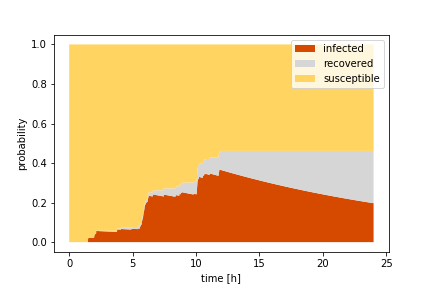
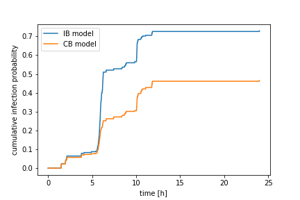

# Contact-Based Epidemiology on Temporal Networks

We provide a package that integrates the contact-based model for SIR type of epidemic spreading given a time-stamped edgelist. For details see:

*Koher et al. [**Contact-based model for epidemic spreading on temporal networks**](https://arxiv.org/abs/1811.05809) Arxive 1811.05809, (2018*

The algorithm is based on the dynamic message passing framework introduced for static networks in:  

*Lokhov et al. [**Inferring the origin of an epidemic with a dynamic message-passing algorithm**](https://arxiv.org/abs/1303.5315), Phys. Rev. E 90, 1, 012801 (2014*

The contact-based model allows to calculate the marginal probability to find a node in the susceptible, infected or, recovered state over time. We assume a standard non-Markovian SIR model and given a time-varying topology the function `integrate_contact_based_model` integrates the contagion process. Unlike previous approaches that focused on nodes - the individual-based (IB) approach - and thus approximated the marginal probability directly, we propose edges as central objects in the contact-based (CB) model. The shift allows to improve analytical predictions with respect to Monte-Carlo simulations as analysed in [*Koher et al.*](https://arxiv.org/abs/1811.05809).

When you use this code, please cite the above references. Otherwise you are free to modify and distribute. Moreover, I am happy to receive your suggestions and critics. For a quick try, you can download / clone the directory and go through the jupyter notebook or implement the minimal example below.

The test data set *sociopatterns_ht09.csv* is taken from the [*sociopatterns.org*](http://www.sociopatterns.org/datasets/hypertext-2009-dynamic-contact-network/) project. The time-stamped edgelist reflects (temporal) contacts between participants during a three day conference. Here, we restrict the observation time to one day and rename nodes to meet the required data format. 

# Data format

The edgelist is provided through a numpy array with dimensions: (number of (temporal contacts) x 3. The columns denote: time, source, target in that order. By default we expect directed contacts, otherwise change the key-word argument to `directed = False` (see parameters). Value type is integer, i.e. for both time and nodes. Time is assumed to start from 0 and nodes have to be labeled continuously from  0 and 'number of nodes'-1.

# Minimal example

```python
from contact_based_model import integrate_contact_based_model 
import numpy as np
import matplotlib.pyplot as plt

beta = 0.0001 #recovery probability
alpha = 100 * beta #infection probability

kwargs = {
    "outbreak_origin" : 94, # choose a node between 0 and 100 (excluded)
    "verbose" : True, # progress bar using the tqdm package for jupyter notebook only
    "individual_based" : False, # choose True for individual-based framework
    "Tmax" : None, # maximum time step. Integrates the full edgelist if None
    "directed" : False # contacts in sociopatterns_ht09.csv are undirected 
}

# Contact-based (CB) model
out = integrate_contact_based_model(alpha, beta, edgelist, **kwargs)
susceptible_CB, infected_CB, recovered_CB = out
cumulative_CB = infected_CB + recovered_CB

# observation time is determined by edgelist
# add one time step for initial condition
Tmax = edgelist[-1,0] + 2
time = np.arange(0, Tmax) / 180. #one time step corresponds to 20s

node = 51
plt.fill_between(time, 0, infected_CB[node], facecolor='#d64a00', label="infected")
plt.fill_between(time, infected_CB[node], cumulative_CB[node], facecolor="#d6d6d6", label="recovered")
plt.fill_between(time, cumulative_CB[node], 1., facecolor='#ffd460', label="susceptible")
plt.legend()
plt.ylabel("probability")
plt.xlabel("time [h]")
```


```python
# Contact-based (IB) model
kwargs["individual_based"] = True
out = integrate_contact_based_model(alpha, beta, edgelist, **kwargs)
susceptible, infected, recovered = out

plt.plot(susceptible.mean(axis=0), label="fraction of susceptible nodes")
plt.plot(infected.mean(axis=0), label="fraction of infected nodes")
plt.plot(recovered.mean(axis=0), label="fraction of recovered nodes")
plt.legend()
```


    
